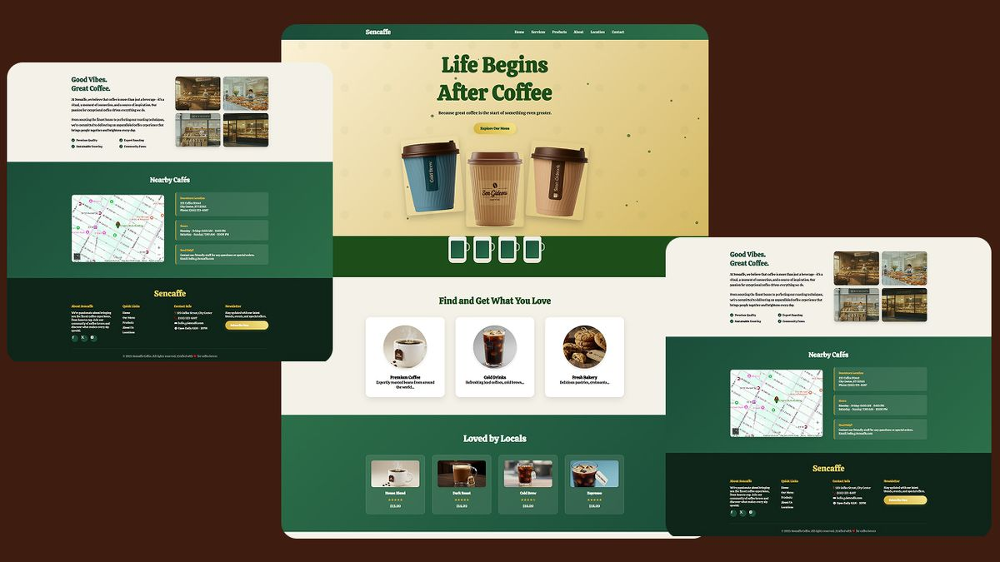

# ☕ Sencaffee Coffee Shop Website Template

🚀 A premium, modern, and fully responsive coffee shop website template built with HTML, CSS, and JavaScript.



Perfect for coffee shops, cafés, and coffee brands looking for a clean and professional online presence.

---

## ✨ Features

- 📱 Fully Responsive Design (Mobile-first)
- 🎨 Modern UI with smooth animations
- ☕ Coffee-themed aesthetic
- 🧭 Responsive Navigation (Mobile menu included)
- 📍 Google Maps Integration Ready
- 📰 Sections Included:
  - Hero
  - About
  - Features
  - Locations
  - News / Blog

---

## 🛠️ Tech Stack

- HTML5
- CSS3 (Flexbox & Grid)
- JavaScript (Vanilla JS)
- Font Awesome Icons

---

____

# ❤️ Watch full Demo video on youtube
👉 https://youtu.be/MwFJ_Dpuwa8?si=KidGdbn03HemkJom ⬅️
____

# ❤️ Get the complete source code

**Source Code:**
[The complete source code for this project can be found here.](https://buymeacoffee.com/sengideons/e/438711)

____

**Contact Me**
- 📺 **YouTube:**  https://www.youtube.com/@SenGideons
- 📈 **Tiktok:**  https://www.tiktok.com/@sengideons
- 🐦 **Twitter:**  https://www.twitter.com/sengideons
- 📸 **Instagram:** https://www.instagram.com/sengideons
- 📘 **Facebook:** https://www.fb.com/sengideons
- 🔗 **Website:** https://www.sengideons.com 

## 🚀 Getting Started

### 1. Clone the repository

```bash
git clone https://github.com/sengideons/sencaffee-coffee-website.git
cd sencaffee-coffee-website

HTML, CSS, GUI, Coffee Shop, Modern UI, JavaScript Projects, HTML GUI, Coding, Programming, Open Source, Tutorial

